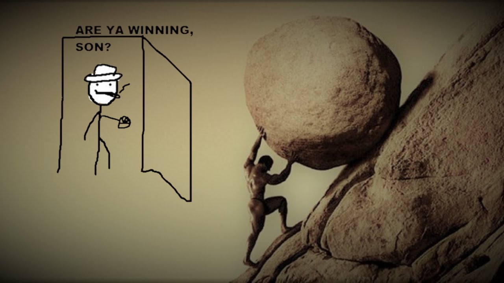

I've recently been thinking a lot about what actually interests me when it comes to programming.

I got into computers tinkering with Linux and Python scripting, before moving into web development, and now as a freelance technical writer. I've always enjoyed learning about (and writing about) complex topics.

And as this year kicked off, I decided to ask myself: what *truly* got me interested in programming?

In other words, what problems and what domain interests me the most?

There's a couple of things which have nerd-sniped me recently and I plan to focus on: Rust and programming languages in general.

I thought I'd talk about why I'm learning these topics for myself, and also in case it helps anyone else 
trying to learn something CS-heavy.

# Why Rust? Why PL theory?

The reason I chose Rust is because in my many (failed) attempts to learn it, I've found it to be a very interesting language.

I'm not even just talking about the memory management semantics, but also its pattern matching, error-handling, data structures, and more. 

Rust is the first time I've really ever experienced learning programming concepts where I am like "wow, this seems to make so much sense to me". 

Adjacent to that, I started to think more about *how* these kind of languages are implemented. 

How do you even go about creating programming languages like these? What is the compiler actually doing? How is my IDE giving me these diagnostics and syntax errors?

Building small developer tools has always been a fascination of mine, but I've never really explored the more complex areas of the tools we use on a day-to-day basis.

Deciding to explore these topics is also quite a **daunting task**. 

Although I am competent at high-level programming and explaining technical subjects, PL theory, compilers, Rust... it is quite heavy stuff for the mere oat-latte sipping, MacBook-using, soydev that I am. 

# Slaying the dragon, climbing the mountain 🚵

The biggest thing about this switch is that I got into progrmaming and work self-taught, and I have *some* traditional CS knowledge, but not much. 

CS theory both fascinates me and terrifies me.

Since I'm talking about taking on two very difficult things, I better make sure I have a decent plan to succeed.

## The doing

I've started to map out a plan at the start of each month with some abstract and concrete goals for what I want to achieve.

Abstract goals aren't typically helpful - for example, "Get more confident in Rust programming". But I find these help guide me to what I need to achieve.

The concrete goals *must* be **measurable**. They might be something like:

- Read chapters 1-8 of the Rust Book
- Create a small Markdown parser in Rust (this should be split into sub-tasks to make it less abstract)
- Watch the first two video lectures on Stanford's compiler course
- Make a blog post on my transition focus 

I then split these up into tasks for each week.

Another thing which I constantly have to remind myself is that having a **growth mindset** is the most important thing you can do. 

We live in a golden age of information, books, videos, and more, and so lack of information is not an issue. It's what resources we decide to use, and how we learn that is the most important thing. I wrote another [blog post](https://techne98.com/blog/the-art-of-independent-learning) on this.

There's not much more to say here, I just wanted to share my justifications and reasons for this - and hopefully inspiring some others who may feel trapped in the world of high-level programming to get the confidence to explore something new. 

Thanks for reading!
