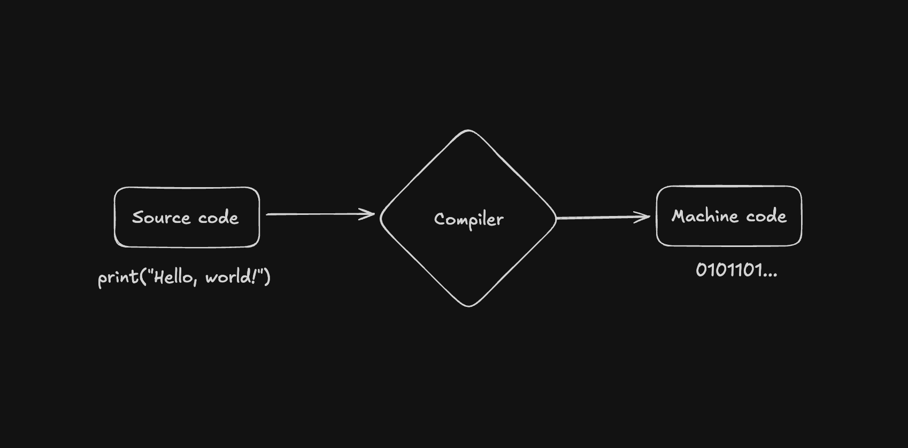
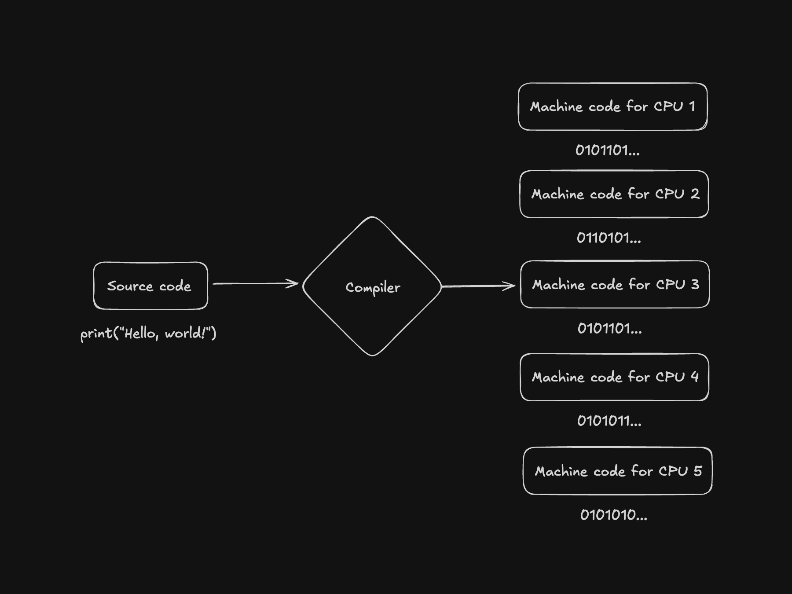
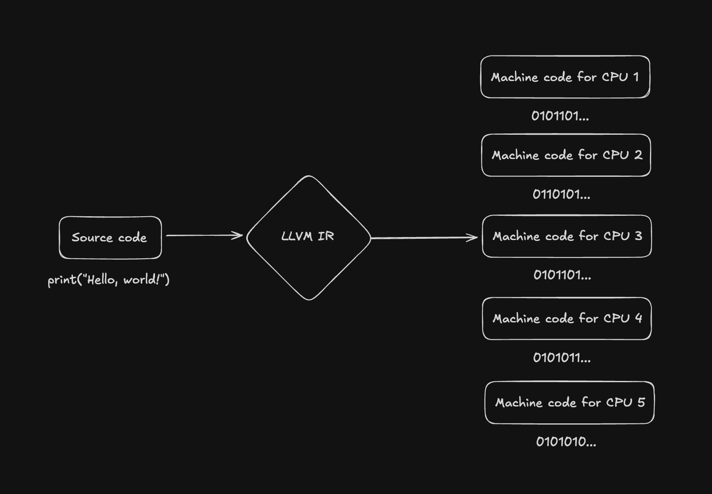

Most developers have heard about "compiled" and "interpreted" programming languages, although
I've found this isn't quite as black and white as it seems.

How programming languages actually *run* on our computers is an interesting topic, and in this post I'll talk about machine code, compilers, LLVM, and why the lines between these are actually quite blurry. 

# A whistle-stop tour of machine code 🚂

The long and short of compilers begins with hardware.

The CPUs in our computers only understand **machine code**. In other words, 0s and 1s. 

Millions of zeroes and ones are executed on our CPUs as we run programs on our computers.

This is the language of computer hardware, but it isn't one we as humans easily understand (and I imagine it wouldn't be particularly fun to write).

For this reason, we invented programming languages, such as Assembly and C. 

These programming languages are something that make it easier for *humans* to write instructions for a computer. But as computers can only understand machine code, we need a way to get back to 1s and 0s. 

# Enter compilers

Compilers are programs which take **source code**, or the actual code we're used to writing when we program, and convert it to machine code for the CPU to execute.

Here's where things do get a *little* more complicated though.

Although this nice little diagram makes it seem nice and easy, a compiler is usually doing a lot of work under the hood.

Lots of different computers have lots of different CPUs.

Different CPUs have different ways to execute instructions. This means although it still executes 1s and 0s, some CPUs will expect them in a different format or sequence to others.

This means the compiler has to make sure it outputs the **correct** machine code for each CPU, depending on what system the code is running on.

This is without even talking about the other work the compiler is doing (optimizations, removing dead code, etc.).

# A detour to LLVM

The part of the process described above is usually what a **compiler backend** takes care of. 

For C and C++ for example, the `gcc` compiler will create an executable program, 1s and 0s, for the platform you are on. 

But if you're creating a new programming language today, doing this yourself can be an insurmountable task (although some programming languages still happily do it).

Let's loop back to our previous diagram, and adjust it to show what it really looks like. 

A tool which exists to help programming language designers tackle this problem is LLVM (what originally stood for Low Level Virtual Machine).

LLVM is, essentially, a compiler backend for a lot of programming languages.

Instead of creating a compiler backend for every single CPU out there, programming language developers can make their language compile to **LLVM IR**.

IR stands for Intermediate Representation. LLVM handles the conversion of *this* code to machine code for many of the different CPU architectures out there. 

If this doesn't quite make sense to you yet, think about it this way.

Imagine you're creating a new programming language called NuLang.

You want people to be able to write programs in NuLang, and let them compile it to machine code and execute it on their computer.

The problem is you don't want to, or can't, or don't have the resources to build out your own compiler backend for every single CPU architecture out there.

So, instead of writing all of these different instructions, you make your programming language compile to LLVM IR.

You just have to target one language, and LLVM handles optimizations and the conversion to machine code for you. This definitely lowers the barrier of entry for programming language developers and designers!

# The false dichotomy 

Even before we start talking about interpreted languages or "just in time" (JIT) compiled languages, you can already see that there's quite a lot to what people commonly refer to as compiled languages.

The line gets even blurrier when you start venturing into interpreted languages such as Python and Lua, or into hosted languages like Java and Erlang. 

I plan to cover just-in-time compilation, interpreters, and virtual machines in the next post.

I hope you enjoyed!
