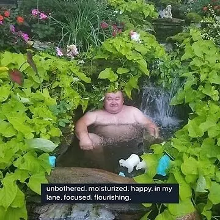

The end of 2025 is closing in, and I've been thinking a lot about how I've been spending my time (particularly online).

There is a lot of cool stuff being built, and I don't want to be dogmatic about my decisions. However,
I think I've come to some conclusions about how exactly I want to spend my time going forward, how my 
approach to using tech is going to change.

But first, some mushy life stuff.

# I got married 💍

In the summer of this year, I got married to the love of my life.

A few months later I got to visit China, which has quckly become one of 
favourite places. Here's a cat on the Mutianyu Great Wall of China. 

As life is coming at me in full force, I've decided I probably need to think about 
how I want to use and work with technology in the coming years.

## Pragmatism

I now have a family, i.e. my wife, which I need to support. This means, generally 
speaking, I have taken a much more pragmatic approach to writing and programming. 

I've always had a soft spot for Linux, FOSS, and  general tinkering. 

But I'm trying to spend my time now more towards things which are valuable both for myself and the world around me.

We all need to make a living somehow, and there is plenty of good closed source software out there (just take a look at [Obsidian](https://obsidian.com)).

This isn't to say that you should throw away all of your niche playthings and just go and learn the most mainstream languages/frameworks/tools.

In fact, I believe this can be counter-productive if anything. But finding a balance between "productivity" and "fun" is probably a good thing for me.

# Narrowing my focus 

Some may think it's the best time to be a generalist given the landscape of tech at the moment, and I'd probably be inclined to agree.

I've been a generalist for a while, and while it is a very rewarding position to work in, I do find myself feeling like I have gaps in my knowledge due to the constant bouncing around between domains, topics, and work.

I'd like to take a more intentional approach to work in general and try and become a little more ["T-shaped"](https://thetshaped.dev/p/the-t-shaped-software-developer). 

# Writing, learning, and building in public

I came across the idea of **asymmetric bets**, a concept popularized by [Naval Ravikant](https://nav.al/).

The general idea is that if doing something has little or no long-term downsides and has the possibility of a large upside, you should try and pursue it (not financial advice).

A typical asymmetric bet on yourself is to make more content. 

In the case of what I'm doing, this is writing more blog posts, producing more videos, and building more software.

Even though I'm a competent person, I'm always a little afraid to write about the things I'm learning or doing.

There is a fear in the back of my mind that someone might think I'm an idiot, or it might somehow hurt my *"professional reputation"*.

But taking the approach of asymmetric bets, the downsides are very small.

Some *x* amount of people might think I'm stupid. 

The potential upside is that **hundreds, thousands, or maybe many more people might see my work**. Some of them may decide to talk with me, or work with me, or share my writing with others.

I want to pursue high-quality and intentional content, but not strive for perfectionism.

Another thing I want to do more of is use public forums.

# Having a bit more fun

At risk of sounding like a hypocrite with all of my focus on pragmatism, I do think it is almost necessary to do this with a very heathly dose of **fun**.

Taking everything too seriously is exhausting. I think we can make very interesting, enjoyable, and cool technology for the web and we should strive to do so.

I plan to make some more fun things next year!

# The elephant in the room

Most of my day job is leading technical writing for public-facing developer tooling companies and ecosystems. These are largely focused on the web.

Seeing the popularity of AI increase and increase has naturally given some rise to the future of this work as a career. 

So, what gives? Do I stop writing? Be a neo-luddite? Or just use the tools?

At the moment, I am simply going to carry on as usual and I'll see what happens. I'll cross that bridge when I get there. 

I plan to open up my own studio next year focused on web education and software inspired by [suckless.org](https://suckless.org/).

And if web engineering disappears, who knows. Maybe I'll just learn a trade or something until the robots replace those, too.

Thanks for reading!
